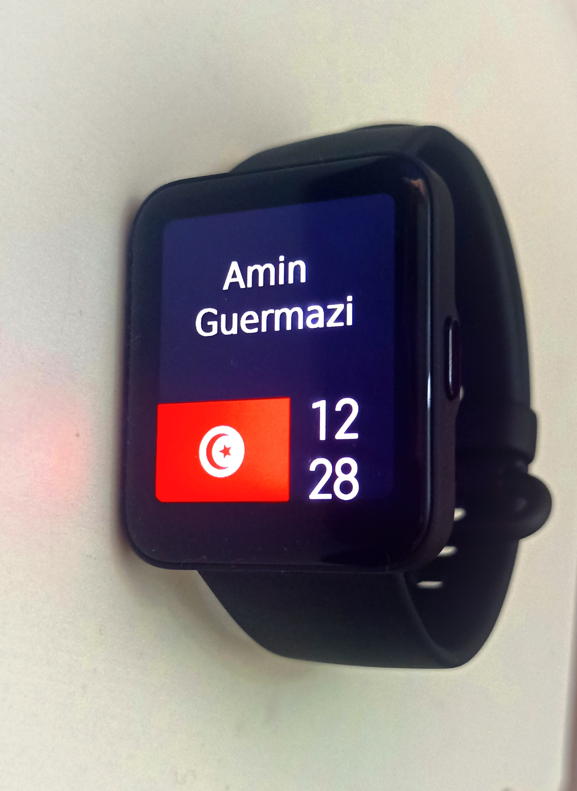
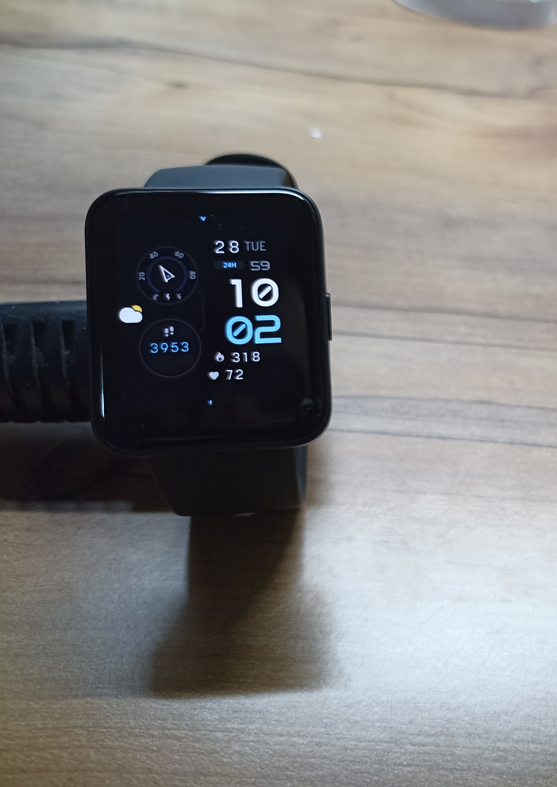

# miwtool
A tool for manipulating Redmi Watch 2 Lite, Redmi Watch 2 China, Poco Watch watchface files

-----
## Installation
- Clone this repository and unzip it
- Make sure that you have python (3.8 +) installed
- Install requirements:
```commandline
python -m pip install -r requirements.txt
```

## Usage
- Unpacking
```commandline
python main.py --decode /path/to/input --output /path/to/output
```
Or use the script example: "scripts for encoding-decoding\unpack.bat" (you must drag and drop the source file/folder to the bat file of the script)

- Repacking
```commandline
python main.py --encode /path/to/input --output /path/to/output
```
Or use the script example: 
1. For Redmi Watch 2 China/Poco Watch: "scripts for encoding-decoding\pack.bat" (you must drag and drop the source file/folder to the bat file of the script)
2. For Redmi Watch 2 Lite: "scripts for encoding-decoding\pack-lite.bat" (you must drag and drop the source file/folder to the bat file of the script)

## Creating Watch Faces the easy way

[Watchface Editor](https://v1ack.github.io/watchfaceEditor/) now includes support for Redmi Watch 2 Lite! 


<details>
    <summary>How to use</summary>

- In the top right corner, press "Devices" and select "Redmi Watch 2 Lite"
- Go to "View" Tab, press "SELECT" button in front of Images and select all
of your custom images (they must be named in order "0.png", "1.png", "2.png"...)
- In "Edit" Tab, you can change watch "Name" under "MetaData", and add a custom "Id" (optional)
- Toggle the components you want to add in the right
- In "Design" Tab, position your components freely
- After finishing, click "EXPORT JSON" and save the file as "watchface.json" 
in the same folder then the images you imported earlier


### Compiling to ready-to-install file
```commandline
python main.py --encode_wfeditor /path/to/input --output /path/to/output
```
Or use the script example: 
1. For Redmi Watch 2 China/Poco Watch: "scripts for encoding-decoding\encode_wfeditor.bat" (you must drag and drop the source file/folder to the bat file of the script)
2. For Redmi Watch 2 Lite: "scripts for encoding-decoding\encode-lite_wfeditor.bat" (you must drag and drop the source file/folder to the bat file of the script)

### Compiling to unpacked file
```commandline
python main.py --decode_wfeditor /path/to/input --output /path/to/output
```
Or use the script example: "scripts for encoding-decoding\decode_wfeditor.bat" (you must drag and drop the source file/folder to the bat file of the script)

where `path/to/input` refers to the folder which contains the exported "watchface.json" and the images

</details>

<details>
    <summary>Folder structure</summary>

```
├── 0000.png
├── 0001.png
├── 0002.png
├── 0003.png
├── 0004.png
├── 0005.png
├── 0006.png
├── 0007.png
...
└── watchface.json
```
</details>

<details>
    <summary>Unsupported features</summary>

- 12/24H format change
- Date OneLine
- Steps Goal, Steps Progress, Steps Progress Circle, Steps Goal Icon
- Distance
- Alarm, Bluetooth, Lock, Do not disturb
- Battery icon, Battery bar
- Weather OneLine, Day Weather, Night Weather, Alt Day Weather, Alt Night Weather
- Air Pollution
</details>

<details>
    <summary>[Notes]</summary>

- Only "Tens" image matters in Time, ("Ones" is ignored) 
- Editing `config.json` (see "Details about unpacked file") gives you a more 
complete control over features (exclusive: analog, ...)
- Weather CustomIcon must be in this exact order: 
Sunny, Cloudy, Overcast, Showers, Thunder Storm, Snowy, Sleet, Moderate Rain, Heavy Rain,
Weak Snow, Moderate Snow, Heavy Snow, Very Heavy Snow, Foggy, Windy, Weak Snow,
Loop (?), Unknown Data, Showers

</details>

##  Watch Faces extraction
To extract watch faces, you need to install Mi Fitness on an android 
device, download a watchface, and then navigate to 
```
Android/data/$PACKAGE_NAME/files/WatchFace
```
(`$PACKAGE_NAME` might be `com.mi.health` 
or `com.xiaomi.wearable` depending on your region)

## Details about unpacked file
<details>
  <summary>folder tree</summary>

```
.
├── config.json
├── images_0
│   └── static.png
...
├── images_11
│   ├── image_0.png
│   ├── image_1.png
...
│   ├── image_8.png
│   └── image_9.png
└── images_preview
    └── static.png
```
</details>

<details>
<summary>config.json structure</summary>

```
{
    "name": "Watch Face Name",
    "id": "12345678",
    "preview": {
        "static": "path/to/preview.png"
    },
    "components": [
        {
            "x": 0,
            "y": 0,
            "static": "background.png"
        },
        ...
        ]
    }
}
```

</details>

<details>
<summary>component attributes</summary>


| Attribute           | Condition       | Description                                      | Data type     |
|---------------------|-----------------|--------------------------------------------------|---------------|
| x                   | *               | x coordinate                                     | int16         |
| y                   | *               | y coordinate                                     | int16         |
| static              | optional        | static image path                                | string        |
| dynamic             | optional        | dynamic images paths                             | array[string] |
| type                | optional        | defines the type of a dynamic widget             | object        |
| -- category         | *               | [TIME / BATTERY...]                              | string        |
| -- type             | *               | [HOUR / TEMPERATURE / ...]                       | string        |
| -- format           | *               | the format to display  the data                  | string        |
| -- coordinate_types | *               | what x and y mean                                | string        |
| pivot_x             | if R            | xcenter of rotation                              | int16         |
| pivot_y             | if R            | ycenter of rotation                              | int16         |
| max_value           | if R            | max_value that defines a rotation                | int16         |
| max_degrees         | if R            | degrees corresponding to max_value (3600° is 2π) | int16         |
| values_ranges       | if FORMAT_IMAGE | value range for each image                       | array[uint32] |
| spacing             | optional        | spacing in pixels at the end of each image       | int           |

</details>

<details>
<summary>[Notes]</summary>

- Images can have any names and can be placed in any folder
- All categories, types, formats, and coordinate_types can be found in `constants.py`
- Examples can be found in ./examples/watchfaces/decoded
</details>

## How to upload a custom watch face to the watch
https://github.com/Mino260806/mi-watchface-uploader

-----
# Examples

<details>
  <summary>Decoded "Multifunction" watchface from Mi Fitness</summary>


</details>
  
<details>
  <summary>Watchface created from scratch and uploaded to the watch  </summary>



</details>


<details>
  <summary>"Minecraft 1.0" watchface ported from GTS 2 mini </summary>


Source: https://amazfitwatchfaces.com/gts/view/9999

</details>

<details>
  <summary>"Dynamic" watchface ported from GTS 3 / GTS 4 </summary>


Source: https://amazfitwatchfaces.com/gts/view/9953

</details>

