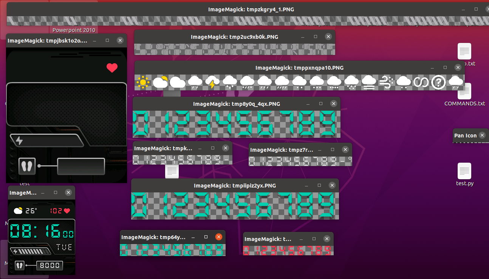

# miwtool
A tool for manipulating Redmi Watch 2 Lite watchface files

-----
## Installation
- Clone this repository and unzip it
- Make sure that you have python (3.8 +) installed
- Install requirements:
```commandline
pip install -r requirements.txt
```

-----
## Usage
- Unpacking
```
main.py --decode /path/to/input --output /path/to/output
```

- Repacking
```
main.py --encode /path/to/input --output /path/to/output
```

------
##  Watch Faces extraction
To extract watch faces, you need to install Mi Fitness on an android 
device, download a watchface, and then navigate to 
```
Android/data/$PACKAGE_NAME/files/WatchFace
```
(`$PACKAGE_NAME` might be `com.mi.health` 
or `com.xiaomi.wearable` depending on your region)

------
# Demo

